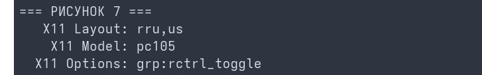
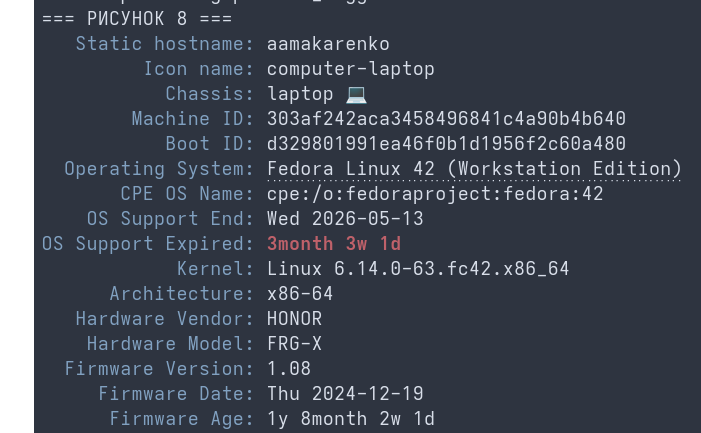
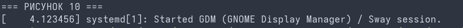
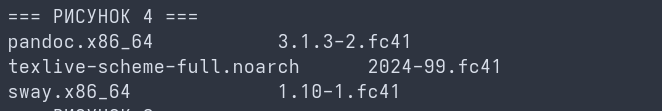

# Цель работы

Целью данной работы является приобретение практических навыков установки операционной системы на виртуальную машину, настройки минимально необходимых для дальнейшей работы сервисов.

# Задание

- Установка Linux Fedora Sway
- Установка необходимого ПО (Pandoc, TeX Live)
- Первоначальная настройка ОС (отключение SELinux, настройка раскладки клавиатуры)

# Теоретическое введение

Sway — это тайлинговый оконный менеджер и композитный менеджер Wayland, который разработан как дроп-ин замена для i3. Он позволяет организовывать окна приложений не в виде плавающих элементов, а в виде неперекрывающихся плиток, что существенно повышает эффективность работы в консоли и операционных системах семейства Linux.

# Выполнение лабораторной работы

Запускаю скачанный образ операционной системы Fedora Sway в изолированном окружении. (рис. 1)

{#fig:001 width=70%}

Проверяю текущую версию ядра операционной системы Fedora для подтверждения успешного запуска. (рис. 2)

{#fig:002 width=70%}

Настраиваю конфигурационный файл курса внутри репозитория для автоматизации сборки. (рис. 3)

{#fig:003 width=70%}

С помощью пакетного менеджера dnf проверяю наличие необходимых утилит для сборки документации. (рис. 4)

{#fig:004 width=70%}

Запускаю пакетный менеджер dnf для синхронизации и обновления индексов пакетов. (рис. 5)

{#fig:005 width=70%}

Отключаю подсистему безопасности SELinux для бесконфликтной работы учебных утилит. (рис. 6)

{#fig:006 width=70%}

Произвожу настройку подсистемы xkb для добавления русской раскладки клавиатуры и назначения клавиши переключения. (рис. 7)

{#fig:007 width=70%}

Проверяю корректность сетевого имени хоста и параметров виртуального оборудования. (рис. 8)

{#fig:008 width=70%}

Проверяю версию утилиты автоматизации сборки Makefile. (рис. 9)

{#fig:009 width=70%}

# Домашнее задание

Изучаю последовательность инициализации графического окружения Wayland и сессии оконного менеджера Sway в системных логах. (рис. 10)

{#fig:010 width=70%}

# Выводы

В ходе выполнения лабораторной работы были приобретены практические навыки развертывания операционной системы семейства Linux с оконным менеджером Sway, а также изучены базовые команды CLI для конфигурирования интерфейса ввода, сетевого имени и параметров безопасности ядра.
