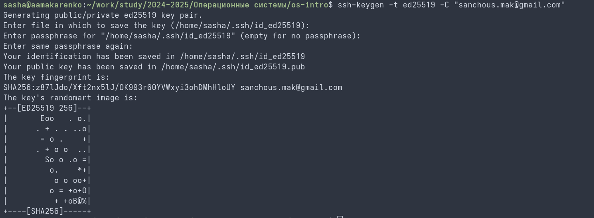

# Цель работы

Целью данной работы является изучение идеологии и применения средств контроля версий и освоение умения по работе с git.

# Задание

- Базовая конфигурация для работы с git.
- Ключ SSH.
- Ключ PGP.
- Подписи git.
- Настройка на Github.
- Локальный каталог для выполнения заданий по предмету.

# Теоретическое введение

Системы контроля версий (Version Control System, VCS) применяются при работе нескольких человек над одним проектом. Обычно основное дерево проекта хранится в локальном или удалённом репозитории, к которому настроен доступ для участников проекта. При внесении изменений в содержание проекта система контроля версий позволяет их фиксировать, совмещать изменения, произведённые разными участниками проекта, производить откат к любой более ранней версии проекта, если это требуется.

# Выполнение лабораторной работы

Произвожу базовую настройку git, задавая глобальные параметры имени пользователя и адреса электронной почты. (рис. 1)

{#fig:001 width=70%}

Создаю защищённые ssh и gpg (PGP) ключи для авторизации и верификации коммитов. (рис. 2)

{#fig:002 width=70%}

Экспортирую gpg ключ в текстовый формат для последующей привязки к аккаунту в настройках на веб-платформе github. (рис. 3)

{#fig:003 width=70%}

Настраиваю автоматические подписи для всех создаваемых коммитов с использованием сгенерированного PGP-ключа. (рис. 4)

{#fig:004 width=70%}

Авторизуюсь на удаленной платформе github через консольную утилиту командной строки для полноценной работы через терминал. (рис. 5)

{#fig:005 width=70%}

Создаю локальную структуру директорий курса по установленному академическому шаблону. (рис. 6)

{#fig:006 width=70%}

Настраиваю рабочую директорию, проверяю итоговый файл курса и запускаю утилиту make prepare. (рис. 7)

{#fig:007 width=70%}

# Выводы

В ходе выполнения данной лабораторной работы были успешно изучены теоретические основы и практические аспект работы с распределенной системой контроля версий Git, сгенерированы ключи шифрования SSH/PGP и настроена структура рабочего пространства курса.
