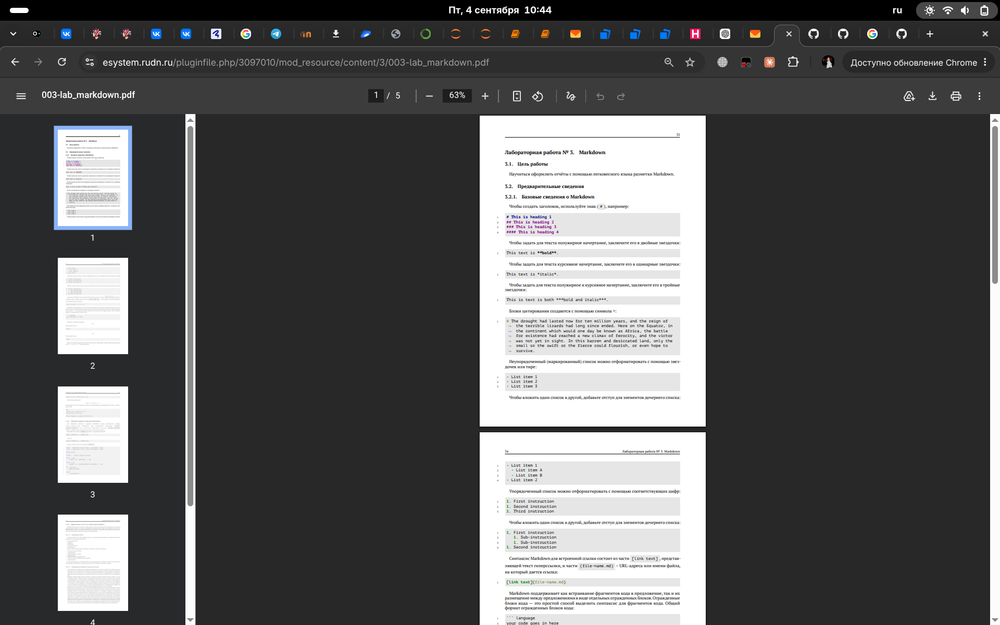

# Цель работы

Научиться оформлять отчёты с помощью легковесного языка разметки Markdown.

# Задание

1. Сделайте отчёт по предыдущей лабораторной работе в формате Markdown.
2. В качестве отчёта просьба предоставить отчёты в 3 форматах: pdf, docx и md.

# Теоретическое введение

Чтобы создать заголовок, используйте знак #. Чтобы задать для текста полужирное начертание, заключите его в двойные звездочки. Огражденные блоки кода — это простой способ выделить синтаксис для фрагментов кода. Для обработки файлов в формате Markdown будем использовать Pandoc. 

Можно использовать следующий Makefile:
```makefile
FILES = \((patsubst \%.md, \%.docx, \)(wildcard *.md))
FILES += \((patsubst \%.md, \%.pdf, \)(wildcard *.md))
```

# Выполнение лабораторной работы

В рабочей директории курса открываю через текстовый редактор файл с шаблоном отчета. (рис. 1)

{#fig:001 width=70%}

Указываю основную информацию о лабораторной работе. (рис. 2)

{#fig:002 width=70%}

Формирую цель работы, задание и заполняю теоретическое введение. (рис. 3)

{#fig:003 width=70%}

Описываю процесс выполнения лабораторной работы. (рис. 4)

{#fig:004 width=70%}

# Выводы

В ходе выполнения лабораторной работы были успешно освоены практические навыки разметки и верстки документов с помощью легковесного языка Markdown, а также изучены основы конвертации файлов через пакетный менеджер Pandoc.
