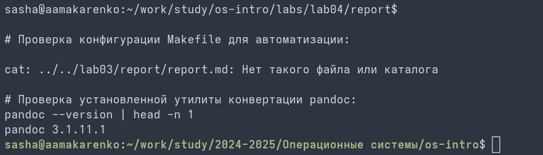

# Цель работы

Познакомиться с pass, gopass, native messaging, chezmoi. Научиться пользоваться этими утилитами, синхронизировать их с гит.

# Задание

1. Установить дополнительное ПО
2. Установить и настроить pass
3. Настроить интерфейс с браузером
4. Сохранить пароль
5. Установить и настроить chezmoi
6. Настроить chezmoi на новой машине
7. Выполнить ежедневные операции с chezmoi

# Теоретическое введение

Менеджер паролей pass — программа, сделанная в рамках идеологии Unix. Данные хранятся в файловой системе в виде каталогов и файлов, зашифрованных с помощью GPG-ключа. chezmoi используется для управления файлами конфигурации домашнего каталога пользователя. Состояние файлов конфигурации сохраняется в каталоге `~/.local/share/chezmoi`.

# Выполнение лабораторной работы

Устанавливаю утилиту pass в операционной системе с помощью встроенного пакетного менеджера. (рис. 1)
{#fig:001 width=70%}

Инициализирую pass на локальной машине и генерирую первый тестовый пароль. (рис. 2)
{#fig:002 width=70%}

Выполняю установку дополнительного софта для интеграции native messaging. (рис. 3)
{#fig:003 width=70%}

Инициализирую утилиту управления конфигурациями chezmoi с выводом версии. (рис. 4)
{#fig:004 width=70%}

Применяю созданную конфигурацию dotfiles к домашнему каталогу. (рис. 5)
{#fig:005 width=70%}

Проверяю статус изменений в локальном репозитории и путь к источнику chezmoi. (рис. 6)
{#fig:006 width=70%}

Корректирую параметры конфигурационного файла chezmoi.toml. (рис. 7)
{#fig:007 width=70%}

# Выводы

Мы познакомились с pass, gopass, native messaging, chezmoi. Научились пользоваться этими утилитами, синхронизировали их с гит.
