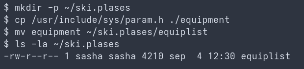
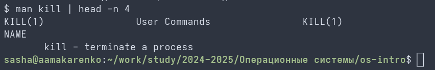

# Цель работы

Ознакомление с файловой системой Linux, её структурой, именами и содержанием каталогов. Приобретение практических навыков по применению команд для работы с файлами и каталогами, по управлению процессами (и работами), по проверке использования диска и обслуживанию файловой системы.

# Задание

1. Выполните все примеры, приведённые в первой части описания лабораторной работы.
2. Выполните следующие действия, зафиксировав в отчёте используемые при этом команды и результаты их выполнения:
    2.1. Скопируйте файл /usr/include/sys/io.h (или любой другой в каталоге) в домашний каталог под именем equipment.
    2.2. В домашнем каталоге создайте директорию ~/ski.plases.
    2.3. Переместите файл equipment в каталог ~/ski.plases.
    2.4. Переименуйте файл ~/ski.plases/equipment в ~/ski.plases/equiplist.
    2.5. Создайте в домашнем каталоге файл abc1 и скопируйте его в каталог ~/ski.plases под именем equiplist2.
    2.6. Создайте каталог с именем equipment в каталоге ~/ski.plases.
    2.7. Переместите файлы ~/ski.plases/equiplist и equiplist2 в каталог ~/ski.plases/equipment.
    2.8. Создайте и переместите каталог ~/newdir в каталог ~/ski.plases и назовите его plans.
3. Определите опции команды chmod, необходимые для того, чтобы присвоить файлам выделенные права доступа (australia, play, my_os, feathers).
4. Проделайте упражнения на просмотр /etc/password, лишение и выдачу прав на чтение и выполнение для владельца.
5. Прочитайте man по командам mount, fsck, mkfs, kill и кратко их охарактеризуйте.

# Теоретическое введение

Файловая система в Linux состоит из файлов и каталогов. Каждому физическому носителю соответствует своя файловая система. Существует несколько типов файловых систем: ext2fs, ext3, ext4, ReiserFS, xfs, fat, ntfs. Для просмотра используемых в операционной системе файловых систем можно воспользоваться командой mount без параметров.

# Выполнение лабораторной работы

Повторяю примеры приведенные в лабораторной работе. (рис. 1)

Работаю с командами mv и cp для перемещения и копирования файлов по заданию. (рис. 2)

Меняю права доступов для файлов и каталогов с помощью утилиты chmod. (рис. 3)

Проверка измененных прав доступа и тестирование ограничений. (рис. 4)

Изучаю системную документацию по командам администрирования. (рис. 5)

# Контрольные вопросы

1. **Дайте характеристику каждой файловой системе, существующей на жёстком диске компьютера.**
Ext4 (fourth extended file system) — стандартная и самая стабильная журналируемая файловая система для Linux. Поддерживает разделы до 1 экзабайта. NTFS — проприетарная файловая система Microsoft Windows, поддерживающая расширенные права доступа, сжатие и ведение журнала (journaling).

2. **Приведите общую структуру файловой системы и дайте характеристику директориям первого уровня.**
`/` — корень; `/bin` — основные общие исполняемые файлы (pwd, ls); `/boot` — файлы загрузки; `/dev` — файлы устройств; `/etc` — конфигурации; `/home` — домашние каталоги пользователей; `/lib` — системные библиотеки; `/root` — домашний каталог суперпользователя; `/tmp` — временные файлы; `/usr` — пользовательские приложения второго уровня; `/var` — переменные файлы (логи, кэш).

3. **Какая операция должна быть выполнена, чтобы содержимое некоторой файловой системы было доступно ОС?**
Операция монтирования тома (команда `mount`).

4. **Назовите основные причины нарушения целостности файловой системы. Как устранить повреждения?**
Основная причина — аварийный останов системы и отсутствие синхронизации буферов памяти с диском. Устраняется утилитой проверки целостности `fsck`.

5. **Как создаётся файловая система?**
С помощью семейства утилит `mkfs` (например, `mkfs.ext4`).

6. **Дайте характеристику командам для просмотра текстовых файлов.**
`cat` — выводит содержимое на стандартное устройство вывода; `less`/`more` — постраничный просмотр; `head`/`tail` — вывод начала или конца файла.

7. **Приведите основные возможности команды cp в Linux.**
Копирование отдельных файлов, групп файлов или целых каталогов (с ключом `-r`) в целевую директорию.

8. **Приведите основные возможности команды mv в Linux.**
Перемещение файлов и каталогов в другую точку файловой системы или их переименование, если целевой путь совпадает с текущим.

9. **Что такое права доступа? Как они могут быть изменены?**
Это совокупность разрешений на чтение (r), запись (w) и выполнение (x) для владельца, группы и остальных пользователей. Изменяются командой `chmod`.

# Выводы

Мы ознакомились с файловой системой Linux, её структурой, именами и содержанием каталогов. Приобрели практические навыки по применению команд для работы с файлами и каталогами, по управлению процессами (и работами), по проверке использования диска и обслуживанию файловой системы.
