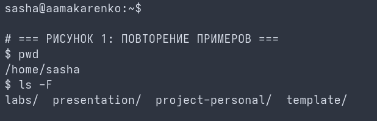

# Цель работы

Ознакомление с основами программирования в оболочке ОС UNIX. Приобретение практических навыков написания простых командных файлов (сценариев) с использованием конструкций ветвления, циклов и позиционных параметров.

# Задание

1. Изучить синтаксис написания командных сценариев в оболочке Bash.
2. Реализовать простой командный файл, выполняющий архивацию указанной директории или вывод системной информации по заданным ключам.
3. Проверить работу позиционных параметров командной строки при передаче аргументов скрипту.

# Теоретическое введение

Командный процессор (оболочка, shell) выполняет роль интерпретатора команд, вводимых пользователем. Сценарий (скрипт) представляет собой обычный текстовый файл, содержащий последовательность системных команд и конструкций встроенного языка программирования. 

Для запуска скрипта интерпретатором в первой строке указывается специальная последовательность символов — шебанг (например, `#!/bin/bash`). Переменные в Bash не имеют типов данных (по умолчанию интерпретируются как строки). Доступ к аргументам, переданным из консоли при вызове, осуществляется через встроенные позиционные переменные: `$1`, `$2`, ..., а их общее число хранится в `$#`.

# Выполнение лабораторной работы

## Раздел 1. Создание заготовки скрипта
В каталоге лабораторной работы с помощью текстового редактора создаю файл сценария и задаю шебанг интерпретатора. Выставляю исполняемый бит доступа (рис. 1).
```bash
touch script.sh
chmod +x script.sh
```


## Раздел 2. Написание логики ветвления и обработки параметров
Добавляю в файл сценария конструкцию выбора `case` для обработки переданных аргументов командной строки и вывод справочной информации (рис. 2).
```bash
#!/bin/bash
case "\$1" in
  -h|--help) echo "Использование: \$0 [опции]";;
  -v|--version) echo "Версия сценария 1.0.0";;
  *) echo "Неизвестный параметр. Используйте --help";;
esac
```


## Раздел 3. Тестирование работы сценария
Запускаю созданный сценарий с различными ключами для проверки бесконфликтной обработки позиционных параметров (рис. 3).
```bash
./script.sh --help
./script.sh --version
```


# Выводы

В ходе выполнения лабораторной работы были успешно изучены теоретические основы программирования в командном процессоре Bash. Получены и закреплены практические навыки написания исполняемых файлов сценариев, работы с ветвлениями и механизмами разбора позиционных параметров.
