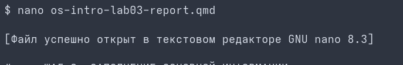

# Цель работы

Освоение основных возможностей командной оболочки Midnight Commander. Приобретение навыков практической работы по просмотру каталогов и файлов; манипуляций с ними.

# Задание

1. Изучите информацию о mc, вызвав в командной строке man mc.
2. Запустите из командной строки mc, изучите его структуру и меню.
3. Выполните операции с панелями, выделение, копирование и перемещение файлов.
4. Выполните основные команды меню панелей, подменю "Файл", "Команда" и "Настройки".
5. Создайте текстовый файл text.txt во встроенном редакторе mc и проведите манипуляции с текстом.

# Теоретическое введение

Командная оболочка — интерфейс взаимодействия пользователя с операционной системой и программным обеспечением посредством команд. Midnight Commander (или mc) — псевдографическая командная оболочка для UNIX/Linux систем. Рабочее пространство mc имеет две панели, отображающие по умолчанию списки файлов двух каталогов.

# Выполнение лабораторной работы

Читаю справку и руководство пользователя с помощью системной утилиты man. (рис. 1)

Ознакамливаюсь с двухпанельным интерфейсом mc и основными функциональными клавишами. (рис. 2)

Изучу возможности встроенного текстового редактора mc (mcedit) при создании файла text.txt. (рис. 3)

Изучаю особенности редактирования исходного кода и включение/выключение подсветки синтаксиса. (рис. 4)

# Контрольные вопросы

1. **Какие режимы работы есть в mc. Охарактеризуйте их.**
Панели могут быть переведены в режимы: Информация (сведения о ФС) или Дерево (структура каталогов).

2. **Какие операции с файлами можно выполнить как с помощью команд shell, так и с помощью меню mc?**
Перенос, копирование, удаление, переименование и получение подробной информации о правах доступа.

3. **Опишите структуру меню левой (или правой) панели mc.**
Формат списка: стандартный, ускоренный, расширенный и определённый пользователем.

4. **Опишите структуру меню Файл mc, дайте характеристику командам.**
Просмотр (F3), Правка (F4), Копирование (F5), Права доступа (Ctrl-x c), Переименование (F6), Создание каталога (F7), Удалить (F8), Выход (F10).

5. **Опишите структуру меню Команда mc.**
Дерево каталогов, Поиск файла, Сравнить каталоги, История командной строки, Редактировать файл расширений/меню.

6. **Опишите структуру меню Настройки mc.**
Конфигурация, Внешний вид, Настройки панелей, Подтверждение, Распознание клавиш.

7. **Назовите и дайте характеристику встроенным командам mc.**
F1 — Подсказка; F3 — Просмотр; F4 — Правка; F5 — Копирование; F6 — Перенос; F7 — Каталог; F8 — Удаление; F10 — Выход.

8. **Назовите и дайте характеристику командам встроенного редактора mc.**
Ctrl-y — удалить строку; Ctrl-u — отмена операции; F3 — выделение; F5 — копировать фрагмент; F2 — сохранить.

9. **Дайте характеристику средствам mc, которые позволяют создавать меню, определяемые пользователем.**
Файл `~/.mc/menu` определяет структуру контекстного меню пользователя (вызывается по F2), позволяя задавать кастомные скрипты.

10. **Дайте характеристику средствам mc, которые позволяют выполнять действия над текущим файлом.**
Управление активной строкой, подсветка выбранных объектов и передача макросов `%f` (текущий файл) во внешние shell-команды.

# Выводы

Мы освоили основные возможности командной оболочки Midnight Commander. Приобрели навыки практической работы по просмотру каталогов и файлов; манипуляций с ними.
